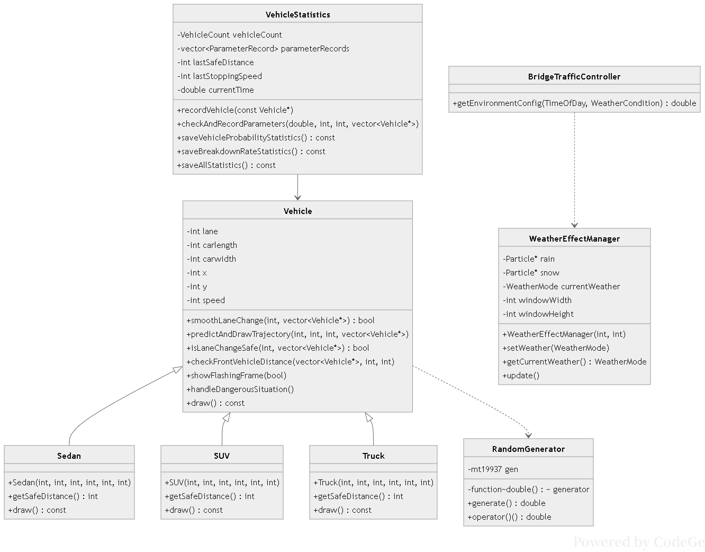
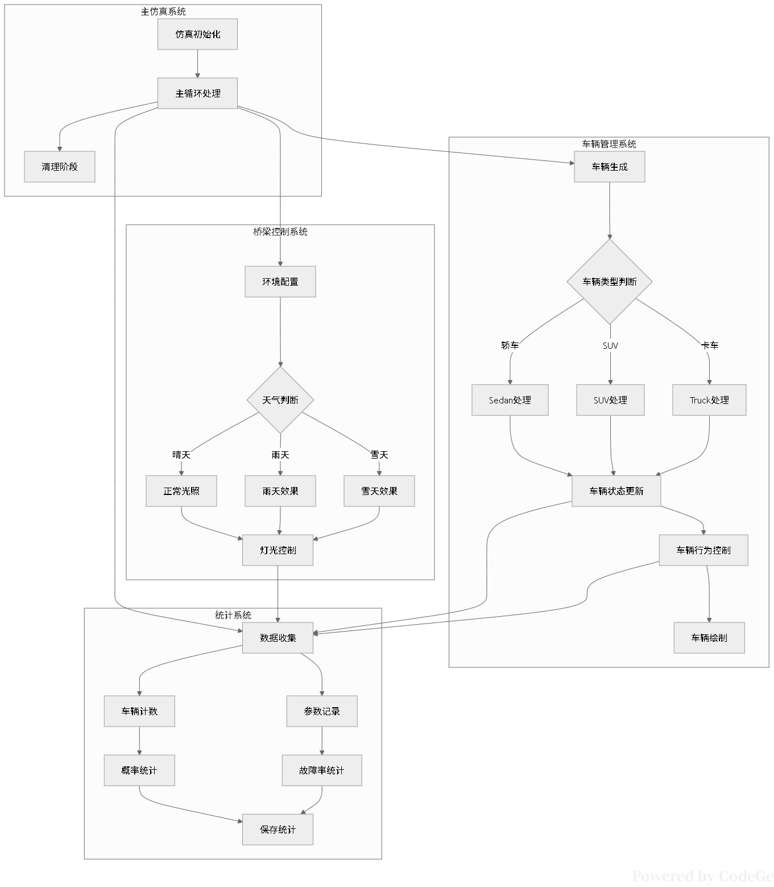
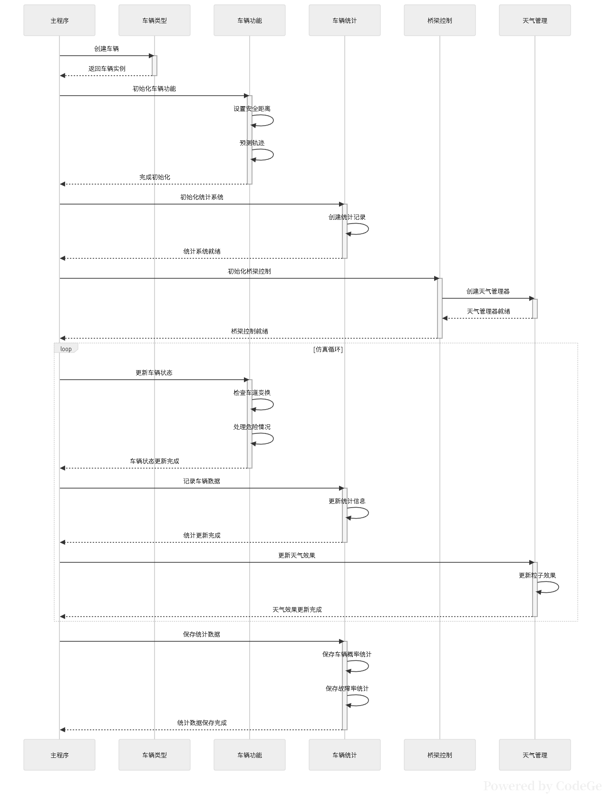

# 随机车流模拟系统开发说明

## 1. 项目概述

本项目为随机车流模拟系统，旨在通过计算机仿真技术模拟真实道路环境中车辆的行驶行为，包括车辆的变道、跟随、碰撞及抛锚等行为。系统考虑了不同天气条件对车辆行驶的影响，实现了较为真实的交通流模拟。

## 2. 开发思路与需求分析

### 2.1 需求分析与功能划分

在收到项目要求后，项目小组首先通过微信讨论确定了系统的核心功能。项目选题为随机车流模拟，重点在于模拟车辆在路面行驶时与周围环境及其他车辆的交互关系，这奠定了系统中车辆变道预测功能的核心地位。

通过对项目要求的逐项分析，我们进行了以下功能归类：

- **车辆状态管理**：将车辆抛锚与碰撞停止功能归为一类，因为两者本质上都是将车辆置为"breakdown"状态
- **车辆行为响应**：将车辆变道与跟随功能归为一类，因为两者均是车辆对周围环境及其他车辆的响应行为
- **环境影响模拟**：查询了国家对于不同天气条件下汽车行驶的制动距离及能见度要求，制作了天气环境对车辆影响的参数表，以此确定环境控制器的逻辑

### 2.2 系统设计思路

经分析，项目中的所有逻辑几乎都与"车辆"这一核心对象相关。结合C++面向对象的设计理念，我们确定了系统的基础架构：

- 设计**Vehicle**基类，包含车辆的基本物理属性及变道、停止等成员方法
- 将白天黑夜及天气情况统一抽象为**环境类**，负责管理外部环境对车辆的影响
- 基于Vehicle基类派生出不同车型的子类，实现差异化行为

## 3. 系统设计

### 3.1 面向对象设计

系统采用面向对象的设计方法，核心类结构如下：

**Vehicle类**：作为基类，包含车辆基本属性（车道、长度、宽度、位置、速度等）和核心行为方法（平滑变道、轨迹预测、安全距离检查等）

**派生类**：Sedan、SUV和Truck，分别实现不同车型的特有行为

**环境相关类**：
- BridgeTrafficController：提供环境配置接口
- WeatherEffectManager：管理天气效果，包括雨、雪等天气对车辆的影响
- RandomGenerator：提供随机数生成功能

**统计相关类**：
- VehicleStatistics：负责收集和保存车辆统计数据

### 3.2 系统流程设计

#### 3.2.1 主流程

系统主流程分为以下阶段：
1. **仿真初始化**：创建必要的对象实例和系统配置
2. **主循环处理**：在每个时间步长内更新车辆状态、环境状态和统计数据
3. **清理阶段**：仿真结束后进行资源清理

#### 3.2.2 时序图

系统各组件交互时序说明：
1. 主程序首先创建车辆实例，初始化车辆功能
2. 随后初始化统计系统和环境控制系统
3. 在仿真循环中：
   - 更新车辆状态（包括检查变道、处理危险情况）
   - 记录车辆数据并更新统计信息
   - 更新天气效果
4. 最后保存统计数据

## 4. 代码实现

### 4.1 代码结构

系统代码组织如下：

- **Car_Sim.cpp**：主程序入口，负责系统初始化和主循环
- **Class.h**：车辆基类定义
- **VehicleTypes.cpp** 与 **VehicleTypes.h**：车辆子类实现
- **BridgeLightingControl.cpp** 与 **BridgeLightingControl.h**：天气及环境控制实现
- **Define.h**：全局变量定义
- **Function.cpp**：辅助函数实现
- **CarFunction.cpp**：车辆相关方法实现

### 4.2 团队协作与版本控制

考虑到本项目需由四人小组共同完成，为确保协同开发和项目管理的可靠性，我们选择使用Git进行源代码管理。项目初期使用Gitee作为托管平台，后因团队成员在分支管理方面遇到问题，转而使用GitHub。

团队工作流程如下：

1. 由wyyyz上传基础目录结构
2. 小组共同讨论各模块接口定义
3. 组员分别fork分支进行开发：
   - wyyyz：实现Vehicle基类与CarFunction.cpp
   - Mike_zhuang：实现VehicleTypes.cpp与VehicleTypes.h
   - soupping与lizhengsheng：实现BridgeLightingControl.cpp与BridgeLightingControl.h
4. 由wyyyz实现主函数Car_Sim.cpp并合并分支

## 5. 系统测试与优化

在系统调试过程中，我们发现并解决了多个问题：

- 车辆转弯轨迹未按预期执行
- 车辆未来轨迹预测精度不足
- 全局参数硬编码导致灵活性不足

针对这些问题，我们进行了以下优化：

1. **开发交互式UI**：实现了一套人性化的交互界面，方便用户使用和调试
2. **实现统计功能**：开发VehicleStatistics类，用于收集和保存车辆运行数据
3. **参数化配置**：将原本硬编码的参数转为可配置项，提高系统的灵活性

## 6. 总结

本项目通过面向对象的设计方法，成功实现了随机车流的仿真系统。系统能够模拟不同天气条件下，多种类型车辆在道路上的交互行为，包括变道、跟随、碰撞及抛锚等。通过严格的团队协作和版本控制，确保了代码质量和项目进度。系统具备良好的扩展性和可配置性，为后续的交通流研究提供了有效的仿真工具。